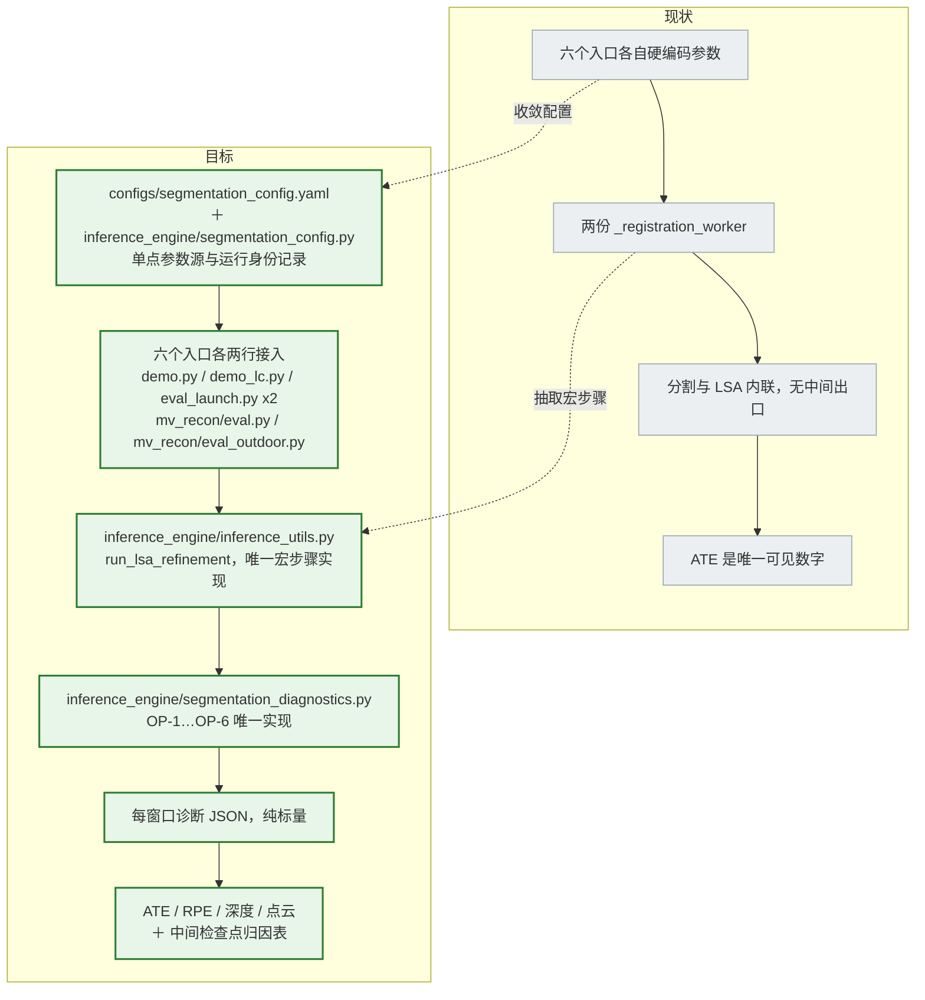
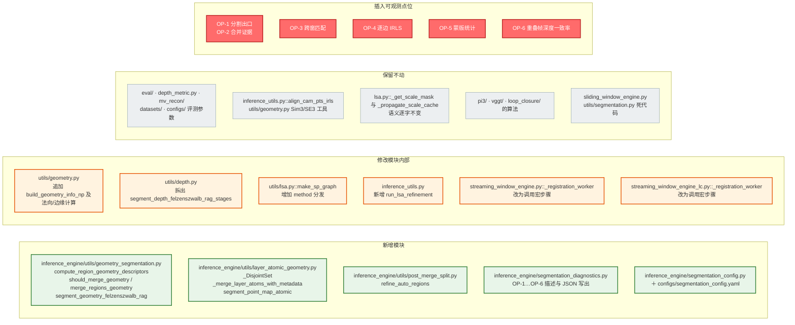

# IDEA-001: Three Initial Segmentation Methods, Attributable Comparison

Status: READY
Relations: none (no prior Idea record exists)

## Problem

The local Baseline has exactly one segmentation form: depth-map Felzenszwalb followed by an
absolute-mean-depth DSU merge (`inference_engine/utils/depth.py::segment_depth_felzenszwalb_rag`).
The Reference branch (`Cjuicy/LASER@codex/keyframe-selection`) adds two further methods:

- `geometry` — geometry-criterion merging;
- `atomic` — atom-level 3D-continuity merging with an optional split.

Both reach the same LSA chain and improve ATE, but three things block attribution:

1. **No intermediate exit.** Between "regions" and "per-pixel scale mask" the chain
   (`make_sp_graph` -> `match_segmentation_seq` -> `assign_overlap_window_depth_scale` ->
   `_get_scale_mask`) exposes nothing. ATE is the only visible number, so the cause of the
   improvement cannot be isolated.
2. **Parameter and code fragmentation.** Six entry points each hard-code window/overlap/confidence;
   `StreamingWindowEngine` and `StreamingWindowEngineLC` each own a copy of `_registration_worker`.
   Any observation would have to be written twice, and entry points are not mutually comparable.
3. **Loop-closure checkpoints were never separated** from the online streaming stage's.

The Idea is a controlled comparison of the three initial segmentation methods with the
segmentation method as the only independent variable, plus a checkpoint chain that makes the
mechanism observable without depending on the final ATE.

## Hypothesis

- **H1 region granularity.** `geometry`/`atomic` produce larger regions that better match true
  depth layers, so the cross-window IoU intersection mask per edge is larger and
  `align_depth_irls` estimates each layer scale more stably.
- **H2 anchor coverage.** Closer-to-true layers mean a higher share of vertices carry a cached
  scale, so the empty-cache fallback `mu_scale = 1.0` in `inference_engine/utils/lsa.py` triggers
  less often and more pixels are genuinely corrected.
- **H3 correspondence correctness.** Closer-to-true layers mean fewer IoU mismatches, so scales are
  applied to the right object.
- **H4 competing explanation.** The improvement comes from more accurate point maps themselves
  (a better Sim(3) in `align_cam_pts_irls`) and not from LSA at all.

H1-H3 live on the segmentation's surface of action; H4 is the rival explanation the checkpoint
chain must rule out.

## Evidence / Findings

| # | Fact | Evidence | Label |
|---|---|---|---|
| E1 | The Reference branch's LSA is **byte-identical** to the Baseline | `inference_engine/anchor_propagation.py` (`align_adjacent_windows_depth_segments`, `_propagate_scale_cache`, `_get_scale_mask`, `AnchorPropagator`) equals `inference_engine/utils/lsa.py::align_adjacent_windows_depth_segments`; `inference_engine/utils/depth.py::align_depth_irls` is identical in both trees. The branch deleted `utils/lsa.py`. | VERIFIED |
| E2 | The depth merge criterion is an absolute difference with strict `<` | `inference_engine/utils/_segmentation_cy.pyx::merge_regions`: `abs(mean_depths[ia] - mean_depths[ib]) < threshold` | VERIFIED |
| E3 | `geometry` uses a 4-channel `[normalized depth, nx, ny, nz]` image plus a three-condition merge | `inference_engine/utils/geometry_segmentation.py::segment_geometry_felzenszwalb_rag_stages`, `should_merge_geometry`, `merge_regions_geometry` | VERIFIED |
| E4 | `atomic` reuses the depth two-stage output as immutable atoms and a coarse-layer prior, then merges by `G_AB = d_AB / sqrt(s_A * s_B)` (same layer `<= 1.1`, across layers `<= 1.0`), with an optional split | `inference_engine/utils/layer_atomic_geometry.py::_merge_layer_atoms_with_metadata`, `segment_point_map_atomic`; `inference_engine/utils/post_merge_split.py::refine_auto_regions` | VERIFIED |
| E5 | The three methods differ only in the per-frame label stage; from `match_segmentation_seq` onward everything is shared | `inference_engine/segmentation/base.py::build_temporal_graphs` | VERIFIED |
| E6 | `geometry` defaults to Felzenszwalb 200/1.0/300 while depth/atomic use 300/1.1/500 | `geometry_segmentation.py` vs `inference_engine/utils/depth.py::segment_depth_felzenszwalb_rag_stages` | VERIFIED |
| E7 | The confidence mask is defined differently in the two trees: locally `np.quantile(conf, p, method='nearest')`; in the Reference `np.quantile(conf[isfinite], 1 - keep_ratio, method='higher')` | `inference_engine/utils/depth.py` vs `inference_engine/segmentation/confidence.py::select_numpy_top_confidence_mask` | VERIFIED |
| E8 | In `geometry`, confidence is a **hard merge condition** (`min(mean_conf_a, mean_conf_b) < conf_thresh` rejects the merge); in depth it only fixes the depth range used for the merge threshold | `geometry_segmentation.py::should_merge_geometry`, `segment_geometry_felzenszwalb_rag_stages` | VERIFIED |
| E9 | `StreamingWindowEngineLC._registration_worker` is a second copy of the baseline worker | `inference_engine/streaming_window_engine_lc.py` vs `inference_engine/streaming_window_engine.py` | VERIFIED |
| E10 | The LC first window builds a graph but a `scale_mask` is never applied to it | `streaming_window_engine_lc.py` (first-window branch builds `tgt_sp_graph` only) vs its `aggregate_caches`, where the mask is applied and the key is absent for window 0 | VERIFIED |
| E11 | At both LC construction sites `top_conf_percentile` stays at its default 0.5 while streaming registration uses 0.3; `sample_interval` is dropped in the `eval_launch.py` LC construction | `loop_closure/loop_closure.py::LoopClosureEngine.__init__` vs `demo_lc.py` and `eval_launch.py` construction sites | VERIFIED |
| E12 | The Reference `geometry` path does not enable the window-reference refiner | `inference_engine/segmentation/window_reference.py` exists but is a separate, default-disabled stage | VERIFIED |
| D1 | Window-reference refinement (keyframe idea) is **excluded** from this Idea | author decision | DECISION |

## Source Anchor

| Field | Content |
|---|---|
| Immediate upstream | `inference_engine/streaming_window_engine.py::_registration_worker` where `local_points` and `camera_poses` already carry `s_d`/Sim(3); LC counterpart in `inference_engine/streaming_window_engine_lc.py` |
| Input data | current-window `local_points` (N,H,W,3), `camera_poses` (N,4,4), `conf` (N,H,W); `prev_window_cache['local_points']`; `anchor_sp_graph`; fixed `ref_intrinsic` |
| Current operation | `make_sp_graph(tgt_depth, conf_map, top_conf_percentile)` -> `refine_depth_segments(...)` -> per-pixel multiplicative scale mask |
| Proposed change boundary | method dispatch inside `make_sp_graph`; observation points before/after the LSA stage; one extracted macro-step shared by both workers |
| Output | corrected `local_points`, `tgt_sp_graph`, `scale_mask` (LC defers the multiplication) |
| Immediate downstream | `_update_cache` / `_save_cache` -> `parse_inference_cache_summary` -> `aggregate_caches` -> `eval/`, `depth_metric.py`, `mv_recon/` |
| Affected runtime variants | `demo.py`; `demo_lc.py`; `eval_launch.py` with `--model=streaming_pi3` and `--model=streaming_pi3_lc`; `mv_recon/eval.py`; `mv_recon/eval_outdoor.py`. `inference_utils.register_extrinsic_windows` is out of scope. |

## Design Decision

| Decision | Choice | Rationale |
|---|---|---|
| Criterion comparison vs baseline | `geometry` uses strict `<` (same form as baseline depth); `atomic` keeps `<=` | Same-form criteria are comparable; `atomic`'s inclusive comparison is part of its mechanism |
| Felzenszwalb parameters | All three locked to 300 / 1.1 / 500 | Yields a pure method difference; explicitly recorded as not the Reference's tuned configuration |
| `depth_merge_thresh` | 0.1 for `geometry` and `atomic` (not the Reference's 0.05) | Keeps threshold changes out of the attribution |
| Normal method | `normal_method = "cross"`, `normal_thresh_deg = 20.0` | Reference defaults, made explicit and recorded in run identity |
| Loop closure | Included, as a second-layer question; LC must set `depth_refine=True` explicitly | The global Sim(3) optimisation can mask per-window error, so LC cannot carry the main conclusion |
| Duplicated worker | Extract macro-step `run_lsa_refinement`; observation points implemented once | Removes double diagnostic code; the LC first-window invariant is locked separately |
| `corr_iou_thresh` | Keep the Baseline's current values (0.3 intra-frame, 0.4 cross-window) | Avoids mixing an unrelated change into the comparison |

## Target Structure



Macro-step contract, which must be element-wise identical to today on the default path:

```python
# inference_engine/inference_utils.py
def run_lsa_refinement(
    prev_local_points,        # previous window's full local_points (function takes [-overlap:])
    cur_local_points,         # current window's local_points
    cur_conf,                 # current window's conf
    anchor_sp_graph,          # previous window's graph
    overlap,                  # int
    segmentation,             # SegmentationConfig
    diagnostics=None,         # DiagnosticsSink | None
) -> tuple[torch.Tensor, list, torch.Tensor | None]:
    """returns (corrected_local_points, tgt_sp_graph, scale_mask)"""
```

Canonical path: `local_points = corrected_local_points` immediately. LC path: store
`working_window['scale_mask'] = scale_mask` and let `aggregate_caches` apply it.

## Boundary

### Change



| Kind | Real path / symbol |
|---|---|
| 新增模块 | `inference_engine/utils/geometry_segmentation.py` — `compute_region_geometry_descriptors`, `should_merge_geometry`, `merge_regions_geometry`, `segment_geometry_felzenszwalb_rag` (forced to `seg_scale=300, seg_sigma=1.1, seg_min_size=500`) |
| 新增模块 | `inference_engine/utils/layer_atomic_geometry.py` — `_DisjointSet`, `_merge_layer_atoms_with_metadata`, `merge_layer_atoms`, `segment_point_map_atomic` |
| 新增模块 | `inference_engine/utils/post_merge_split.py` — `refine_auto_regions` and its `_normal_*` / `_edge_fields` / `_field_contrast` / `_normal_gain` helpers |
| 新增模块 | `inference_engine/segmentation_diagnostics.py` — observation-point descriptors, `DiagnosticsSink`, JSON writer |
| 新增模块 | `inference_engine/segmentation_config.py` + `configs/segmentation_config.yaml` — `SegmentationConfig` and run-identity record |
| 修改模块内部 | `inference_engine/utils/geometry.py` — append `build_geometry_info_np`, `compute_normals_{cross,sobel,pca}_np`, `compute_depth_edge_np`, `compute_normal_edge_np`, `depth_to_local_points_np` |
| 修改模块内部 | `inference_engine/utils/depth.py` — extract `segment_depth_felzenszwalb_rag_stages() -> (initial_labels, coarse_labels, merge_threshold)`; keep the old function as a thin wrapper with byte-identical output |
| 修改模块内部 | `inference_engine/utils/lsa.py::make_sp_graph` — new keyword parameters `method` / `point_map` / `intrinsic` / `segmentation` / `diagnostics`; with defaults (`method='depth'`, no diagnostics) the result is element-wise identical to today |
| 修改模块内部 | `inference_engine/inference_utils.py` — add `run_lsa_refinement`; adapt the three `make_sp_graph` call sites in `register_extrinsic_windows` for the new signature only (that path is unreachable and stays unused) |
| 修改模块内部 | `inference_engine/streaming_window_engine.py` — `__init__` gains `segmentation=None`, `diagnostics=None`; `_registration_worker` calls the macro-step |
| 修改模块内部 | `inference_engine/streaming_window_engine_lc.py` — same two parameters; `_registration_worker` calls the macro-step while preserving "store, do not apply" and "first window builds a graph only" |
| 修改模块内部 | `loop_closure/loop_closure.py` — both construction sites pass `top_conf_percentile` and `sample_interval` explicitly (`demo_lc.py`, `eval_launch.py`) |
| 插入可观测点位 | OP-1 … OP-6 (see Observation Points) |
| 保留不动 | `eval/`, `depth_metric.py`, `mv_recon/`, `datasets/`, evaluation parameters in `configs/` |
| 保留不动 | `inference_utils.align_cam_pts_irls`, `register_adjacent_windows`, existing Sim(3)/SE(3) helpers in `utils/geometry.py` |
| 保留不动 | semantics of `lsa.py::_get_scale_mask` / `_propagate_scale_cache` / `assign_overlap_window_depth_scale`, including the empty-cache `1.0` fallback (read-only) |
| 保留不动 | the algorithms in `pi3/`, `vggt/`, `loop_closure/` |
| 保留不动 (deliberate) | `inference_engine/sliding_window_engine.py`, dead `inference_engine/utils/segmentation.py`, `fast_seg.pyx` |

### Must Preserve

- The training-free contract: π³ stays frozen; no fine-tuning or retraining.
- The window contract: `window_size`, `overlap`, and the overlap-frame trimming in
  `parse_cache_file`.
- The evaluation protocol: `eval/`, `depth_metric.py`, `mv_recon/`, `datasets/seq-id-maps/*.json`
  and `configs/` evaluation parameters are untouched — the measuring instrument is zero-diff.
- The `Vertex` cache structure `{'iou': [], 'scale': []}` and the IoU-weighted-mean semantics of
  `_get_scale_mask`.
- The key set of `window_cache_<id>.pt` and the reading semantics of
  `parse_inference_cache_summary`.
- **Element-wise equality on the default path**: with no new parameters supplied, the depth
  branch output is identical to today.
- The two existing LC behaviours: the first window never receives `scale_mask`; the worker stores
  `sim3`/`scale_mask` instead of applying them.

### Input / Output Contract

| Item | Content |
|---|---|
| New engine parameters | `segmentation: SegmentationConfig | None = None`, `diagnostics: DiagnosticsSink | None = None` (defaults keep the signature backward compatible) |
| New `make_sp_graph` signature | `make_sp_graph(depth, *, depth_merge_thresh=0.1, conf_map=None, top_conf_percentile=None, corr_iou_thresh=0.3, method='depth', point_map=None, intrinsic=None, segmentation=None, diagnostics=None)`; return type unchanged (`list[list[Vertex]]`) |
| `run_lsa_refinement` | inputs as above; output `(corrected_local_points: Tensor, tgt_sp_graph: list, scale_mask: Tensor | None)` |
| `SegmentationConfig` fields | `method`; `conf_keep_ratio`; `corr_iou_thresh_intra=0.3`; `corr_iou_thresh_inter=0.4`; `depth_merge_thresh=0.1`; `seg_scale=300`; `seg_sigma=1.1`; `seg_min_size=500`; `normal_method='cross'`; `normal_thresh_deg=20.0`; `split_mode='conservative'`; `split_score_threshold=0.10`; `irls_iters=10`; `irls_eps=1e-8`; `irls_stop_tol=0.05`; `irls_clamp_min=1e-6` |
| Diagnostic artifacts | `<cache_root>/<tempdir>/segmentation_diag/window_<id>.json`, scalars only; array dumps go to a separate directory only when `dump_arrays` is set |
| Separation rule | `diagnostics.level` / `output_dir` / `dump_arrays` must **not** enter `SegmentationConfig`; changing observation granularity must never change the experiment condition |

### Affected Paths

| Entry point | Route to the macro-step | Note |
|---|---|---|
| `demo.py` | `StreamingWindowEngine._registration_worker` | `--depth_refine` defaults off; must be enabled |
| `demo_lc.py` | `StreamingWindowEngineLC._registration_worker` -> `LoopClosureEngine.run` | requires explicit `depth_refine=True` |
| `eval_launch.py --model=streaming_pi3` | base worker; `depth_refine` engine default True | primary conclusion path |
| `eval_launch.py --model=streaming_pi3_lc` | LC worker -> LC engine | second-layer question path |
| `mv_recon/eval.py` | base worker, `depth_refine=True` | point-map metrics |
| `mv_recon/eval_outdoor.py` | base worker, `depth_refine=False` | outside this round's observation surface |
| `inference_utils.register_extrinsic_windows` | three `make_sp_graph` sites | used only by `SlidingWindowEngine`, which no entry point instantiates (unreachable) |

## Observation Points

| Point | 位置 | 观测什么 | 服务哪个检查点 | 何时产生输出 | 开销与副作用 |
|---|---|---|---|---|---|
| OP-1 | `utils/depth.py::segment_depth_felzenszwalb_rag_stages` return | `initial_labels` (H,W), `coarse_labels` (H,W), `merge_threshold` (float), high-confidence pixel count, `depth_range`; derived region count, area histogram, `regions_per_megapixel` | Local: partition invariants, L2-A segmentation quality; Regression: default-path equality | all three methods (atomic reuses this function) | reads existing intermediates only; O(HW) NumPy scalar statistics per frame, safe to leave on |
| OP-2 | return of `geometry_segmentation.py::merge_regions_geometry`, `layer_atomic_geometry.py::_merge_layer_atoms_with_metadata`, `post_merge_split.py::refine_auto_regions` | labels before/after merge; total adjacent pairs, unions, rejections; quantiles of the criterion (`G_AB`, normal cosine, depth difference); `split_*` diagnostics | Local: did the mechanism act as designed; L2-B criterion-specific tests | geometry / atomic branches only | accumulates scalars inside the existing DSU loops; no new arrays; the split branch is silent when `split_mode='none'` |
| OP-3 | `utils/depth.py::connect_bipartite_sp_graphs` and the `assign_overlap_window_depth_scale` loop | per overlap frame pair: edge count, vertex counts on both sides, pairs rejected by the IoU threshold, degree histogram, **matched-vertex ratio**, IoU quantiles | Local: H1, H3; End-to-End covariates `lsa_matched_vertex_ratio` / `mean_degree` | shared by all three methods, always emitted | traverses the already-computed `iou` matrix; O(N·M) boolean statistics per frame pair |
| OP-4 | `utils/depth.py::_edge_scale_worker` at the `align_depth_irls` call | per edge: `inter_mask` area, `s_d`, iteration count, early-convergence flag, `s_d == clamp_min` count, deviation of `s_d` from 1.0 | Local: direct discriminants for H1 and H3 | shared, always emitted | four scalars per IRLS call; IRLS already dominates, overhead < 1% |
| OP-5 | `utils/lsa.py::_get_scale_mask` and `_propagate_scale_cache` | per vertex `len(cache['scale'])` (**0 means the `1.0` fallback fired**), variance of `cache['scale']`, IoU-weight concentration; final mask `mean/std/p01/p50/p99` and **share of pixels != 1** | Local: direct discriminant for H2 | shared, always emitted | accumulated next to the already-computed `mu_scale`; one O(HW) pass for mask statistics |
| OP-6 | `inference_utils.py::run_lsa_refinement`, before and after the mask is applied | depth-consistency rate after warping overlap frames into the current frame using `camera_poses` and the fixed intrinsic; per-region consistency; before/after difference | End-to-End: the cheapest falsification; Regression: correction must not lower consistency | shared, always emitted | the only new real computation (one warp plus comparison); can be subsampled, and is skipped entirely when `diagnostics=None` |

## Checkpoints

### Baseline

- **Element-wise default equality**: with `method='depth'` and `diagnostics=None`, labels,
  `tgt_sp_graph`, `corrected_local_points` and `scale_mask` are element-wise identical to the
  pre-change behaviour. Hard gate for the depth branch.
- **Fixed baseline numbers**: under the locked parameters (20/5, a single `top_conf_percentile`,
  `depth_refine=True`, 300/1.1/500, 0.1, 0.3/0.4) run `depth` once as the reference point for
  every comparison.
- **Instrument baseline**: `eval/`, `depth_metric.py` and `mv_recon/` produce identical output for
  identical input before and after the change.

### Local

- **L1 invariants** (local CPU, no GPU and no weights):
  - `partition_invariant`: label values are exactly `0..R-1`, cover the whole image, no NaN.
  - `merge_only_invariant`: region count never increases for depth/geometry; the same holds for
    atomic when `split_mode='none'`.
  - `no_silent_failure`: `s_d` is finite and `>= clamp_min`; edges whose `inter_mask` is empty are
    **counted, not silently absorbed**.
  - `determinism`: identical labels, scales and masks on a repeated CPU run.
- **L2 synthetic ground truth** (local CPU; analytically constructed, so ground truth is exact).
  Four fixtures, each targeting a known failure mode:

  | Fixture | Construction | Expected behavioural difference |
  |---|---|---|
  | F1 crease | two planes, depth continuous, normals differing by 40 degrees | depth merges them wrongly; geometry/atomic keep them separate, so OP-2 criterion values exceed threshold on that shared boundary |
  | F2 same-plane far-field fragmentation | one large plane with slow depth drift | region counts differ directly; atomic's scale-normalised gap criterion should fragment least |
  | F3 occluded thin structure | a thin pole over background at a different depth | the initial atom spans both; atomic's cross-layer limit `G_AB <= 1.0` should reject the merge |
  | F4 known layer scales | two windows of one scene, layer depths of window 2 multiplied by known `s*_l` | closed-form assertions: relative error of `estimated_s_l`, `mask_nonidentity_ratio`, share of correctly corrected pixels |

- **L2-A segmentation quality (independent of LSA)**: ARI / VI of region labels against ground-truth
  layers, criterion-violation rate on shared boundaries, area distribution, `regions_per_megapixel`.
- **L2-B landing quality (independent of the segmentation algorithm)**: feed the ground-truth layer
  partition **directly** into `run_lsa_refinement` to obtain `estimated_s_l` and the mask, then
  compare with the result from the method's own partition. The difference is exactly the error the
  method contributes — the only way to separate "what is better and why" from an end-to-end number.
- **L2-C behaviour matrix**: F1-F4 x three methods x expected sign, forming the minimal observable
  matrix of whether each mechanism acts as designed.
- **L2-LC mirror check**: run the same fixtures through the LC path with `depth_refine=True` and
  assert (a) OP-1…OP-6 output matches the canonical path; (b) window 0 has no `scale_mask` and its
  `corrected_local_points == local_points`, verifying that the first window is not corrected.

### End-to-End

- **Primary conclusion**: lock every parameter and vary only `method` over
  `{depth, geometry, atomic}` on the `eval_launch.py --model=streaming_pi3` path; report per-sequence
  ATE / RPE-trans / RPE-rot, **both median and worst sequence** (guarding against an average gain
  with a regressed sequence); on the point-map side report Acc/Comp plus P/R/F at 1/2/5 cm.
- **Second-layer question (loop closure)**: repeat the comparison on `--model=streaming_pi3_lc`,
  adding LP-1…LP-5. This answers "does segmentation still matter under a global constraint"; it does
  not replace the primary conclusion.

  | Loop-closure point | State read |
  |---|---|
  | LP-1 | candidate loop pairs, detector similarity, NMS survival |
  | LP-2 | the two `register_adjacent_windows` calls per constraint: `s`, `R`, `t`, mask pixel counts |
  | LP-3 | `compute_sim3_ab` constraint residual |
  | LP-4 | `Sim3LoopOptimizer` relative delta, iteration count, residual decrease |
  | LP-5 | trajectory jump magnitude before/after applying the delta |

- **Attribution table**: intermediate checkpoints (columns) x per-sequence ATE (rows), with Spearman
  rank correlation. Decision rule: an intermediate that moves with the method **and** correlates
  strongly with ATE is the mechanism; an intermediate that moves while ATE does not follow means the
  improvement comes from outside the observed chain (H4 or something else); an unchanged
  intermediate with changed ATE means the checkpoint coverage is insufficient and the design needs
  more points.

### Regression

- **Untouched path**: `--model=pi3` (`VanillaEngine`, no windowing, no segmentation) is unchanged.
- **Untouched instrument**: output format and values of `eval/`, `depth_metric.py`, `mv_recon/`.
- **Cache compatibility**: the key set of `window_cache_<id>.pt` is unchanged; historical caches
  still parse.
- **Existing LC behaviour**: first window uncorrected; the `ref_sim3[0] * scale_mask` path in
  `aggregate_caches` (including the accumulated-scale carry-over recorded as a source-level
  observation in `docs/dsh/PROJECT_MODEL.md`) is unchanged.
- **Default equality**: the depth branch with `diagnostics=None` is element-wise identical.
- **Performance**: with diagnostics off, per-window wall time changes only within noise; with scalar
  diagnostics on, CPU overhead has a recorded ceiling.

## Rollback Boundary

| Level | How to withdraw | What survives |
|---|---|---|
| Run level | `SegmentationConfig.method='depth'` and `diagnostics=None`; an entry point that passes no new parameter behaves exactly as today | all Baseline and other-Idea behaviour |
| Code level | new code lives in four new modules plus appended functions in `utils/geometry.py`; existing files only gain defaulted keyword parameters and one macro-step call | the `run_lsa_refinement` signature can stay for later Ideas |
| Commit level | macro-step extraction and observation-point insertion are separate commits and revert independently | reverting only the observation points returns to "structure unified, no diagnostics" |
| Data level | diagnostics write into the cache temp directory and a separate output directory; **no cache format change, no viser output change** | historical caches and existing results remain readable |
| Experiment level | L1/L2 synthetic checks are decoupled from L3 real runs, so a failing synthetic check does not invalidate an end-to-end number already obtained | existing ATE results stay valid |

## Open Questions

These do not block implementation planning but must be resolved before or during it.

1. `inference_engine/utils/post_merge_split.py::refine_auto_regions` (528 lines) has not been read in
   full. It is the only reason `atomic`'s region count can **increase**, so the F3 expected sign in
   L2-C must be confirmed before implementation.
2. The Reference `geometry` strategy passes `conf_map` into `segment_geometry_felzenszwalb_rag`, yet
   `conf_thresh` appears omitted inside `segment_geometry_felzenszwalb_rag_stages`. Whether the hard
   confidence merge condition is actually active is UNKNOWN; this design assumes active (evidence
   E8) and implementation must re-check the Reference's real behaviour.
3. `demo.py` builds its frame list with `os.listdir` rather than `sorted(glob(...))`, unlike the
   evaluation paths (recorded as a source-level observation in `docs/dsh/PROJECT_MODEL.md`). This
   design does not change it; L3 takes its numbers only from the evaluation path, which avoids the
   issue.

## Partial Result — implementation and local verification

Recorded after the first implementation pass. Nothing here changes Problem, Hypothesis or the
decisions above; it records what implementing them revealed.

**Status of the three open questions.**

1. `post_merge_split.py::refine_auto_regions` was read in full during implementation. The split
   stage is not dead code: on a fold fixture `split_mode="none"` yields 1 region, `"conservative"`
   yields 1 (markers found, watershed ran, rejected on score because no RGB is supplied), and
   `"normal_only"` yields 2 with `split_accepted_count=1`. A test pins this switch.
2. The geometry hard confidence condition is confirmed active: `merge_regions_geometry` passes
   `conf_thresh` into `should_merge_geometry`. `layer_atomic_geometry.py` contains no `conf_thresh`
   at all, so `atomic`'s 3D-continuity merge genuinely does not use confidence. This is a real
   mechanism difference between the two new methods, not an instrumentation artefact.
3. `demo.py`'s `os.listdir` frame ordering is unchanged. L3 numbers still come only from the
   evaluation path, which sorts.

**A semantics contradiction in `confidence_keep_ratio`, resolved in favour of the Baseline.**

The Reference implementation's `select_numpy_top_confidence_mask` thresholds at
`np.quantile(conf, 1 - keep_ratio)`, so its `keep_ratio = 0.7` keeps the top 30%. This repository's
Baseline computes `np.quantile(conf, p)` with `p = 1 - top_conf_percentile` inside
`segment_depth_felzenszwalb_rag`, i.e. its `0.7` keeps the top 70%. The two conventions cannot both
hold, and an implementation that adopts the Reference's while keeping the Baseline's constant
silently changes the Baseline's segmentation — a Regression-gate violation.

Resolution: `inference_engine/utils/confidence.py` keeps the Reference's *formula* (so its value
stays quotable) and the shipped configuration is `confidence_keep_ratio: 0.7`, which reproduces the
historical `--top_conf_percentile 0.3` exactly. The retained share is `keep_ratio`, the retained
top fraction is what the old flag called the complement, and the module docstring states this. A
test asserts the retained fraction and the threshold, so the convention cannot drift silently.

**Deliberate behaviour change, recorded as such.** `demo.py` used `10/5` and `top_conf_percentile
0.3`; `eval_launch.py` used `20/5` and `0.5` for `streaming_pi3` and `75/30` and `0.3` for
`streaming_pi3_lc`; `mv_recon` used `20/5` and `0.5`; `eval_outdoor` used `60/30`, `0.3` and
`depth_refine=False`. Those per-entry-point values are what made the entry points incomparable, so
the locked configuration now supplies all of them and the old flags were **removed** rather than
left to disagree silently. A comparison must therefore state the schedule it used, which is what
`SegmentationConfig.run_identity()` records.

Three silent-failure defects were found and fixed while wiring, each now covered by a test:

- `--segmentation_method` was written as a top-level override while the file nests everything under
  `segmentation:`, so every run stayed on `depth` while reporting success.
- `LASER_SEGMENTATION_METHOD` had the same defect on the environment path.
- `--segmentation_dump_arrays` alone set a level that `DiagnosticsConfig.active` still reported as
  off, so the flag asking for the most output produced none.

**Four more defects were found while verifying that the observation points actually fire**, all of
them silent, and all now covered by tests. They are recorded because each one would have produced
plausible-looking numbers rather than an error:

1. **Per-frame versus window-level merge threshold.** `run_lsa_refinement` initially passed the
   whole window's confidence to the per-frame segmentation, so the merge threshold became
   `0.1 * (window depth range)` instead of `0.1 * (frame depth range)`. On a window containing both
   a near and a far frame the threshold rose by a factor of about 15, which over-merges the near
   frame. The Baseline has always sliced the confidence per frame; the pipeline now does too.
2. **Diagnostics dropped in a middle layer.** `refine_depth_segments` did not forward `diagnostics`
   (or the IRLS settings) to `align_adjacent_windows_depth_segments`, so OP-3 and OP-4 recorded
   nothing. An observation point that silently records nothing is indistinguishable from a stage
   that genuinely found nothing, which is exactly the ambiguity these points exist to remove.
3. **Region counts inflated by label-space holes.** The Baseline's Cython `merge_regions` renumbers
   regions as `root + 1`, and a DSU root set is not contiguous. Counting with `np.bincount` counted
   the holes, so a method could appear to produce *more* regions than the atoms it started from,
   which is impossible for a merge-only method. Counting now uses `np.unique`.
4. **The violation metric was defined incorrectly.** `boundary_violation_rate` compared the method's
   boundary map against the truth boundary map pixel by pixel, so an *exactly correct* partition
   scored 1.000 — the best answer getting the worst score. Truth boundaries and region boundaries
   sit at different pixels even when the partition is right. The metric now asks the well-posed
   question: of all 4-connected pixel pairs that truly belong to one layer, what fraction did the
   method separate. Over-merging is reported separately as `cross_layer_region_ratio`, since one
   merged region covers arbitrarily many same-layer pairs and would otherwise swamp the first
   number. Four unit tests pin the definition.

Separately, the synthetic camera motion was reduced from 0.03 units and 0.4 degrees per frame to
0.012 and 0.15. The larger motion pushed the anchor window's trailing frames and the next window's
leading frames below the IoU correspondence threshold, which left the correspondence graph
legitimately empty and OP-4 with nothing to measure — a property of the fixture, not of the code,
but one that would have made the check look vacuous.

**L2 observations on the current fixtures.** Reported by
`python scripts/check_segmentation_methods.py`, with `warp_spread = 0.35` so that no single global
scale can explain the two windows. With a single shared factor this checkpoint is uninformative by
construction, which is itself worth knowing. `split` is over-fragmentation (share of truly
same-layer adjacencies left separated); `xlayer` is over-merging (share of regions spanning more
than one true layer). `cost` is the L2-B attribution: the excess per-layer scale error over the
ground-truth-partition floor, which is zero on every fixture.

| Fixture | `depth` | `geometry` | `atomic` |
|---|---|---|---|
| F1 crease | 1 region, ARI 0.000, split 0.000, xlayer 1.000, cost **+0.112** | 2 regions, ARI −0.086, split 0.019, xlayer 0.500, cost **+0.011** | 1 region, ARI 0.000, split 0.000, xlayer 1.000, cost **+0.112** |
| F2 far field | 2 regions, ARI −0.069, split 0.008, xlayer 0.500, cost +0.230 | 1 region, ARI 0.000, split 0.000, xlayer 1.000, cost +0.233 | 1 region, ARI 0.000, split 0.000, xlayer 1.000, cost +0.233 |
| F3 occluder | 3 regions, ARI 0.478, split 0.000, xlayer 0.000, cost +0.000 | 3 regions, ARI 0.383, split 0.022, xlayer 0.667, cost +0.000 | 3 regions, ARI 0.478, split 0.000, xlayer 0.000, cost +0.000 |
| F4 known scale | 2 regions, ARI 0.848, split 0.019, xlayer 0.500, cost +0.000 | 2 regions, ARI 0.595, split 0.016, xlayer 0.500, cost +0.001 | 1 region, ARI 0.000, split 0.000, xlayer 1.000, cost **+0.233** |

These are **not** conclusions about the real data. The fixtures are synthetic, small, and built only
to be analytically exact. What they do establish is that the checkpoint chain discriminates between
the methods, and that it discriminates on mechanism rather than producing one ranking: on F1 the
normal condition is what keeps the crease intact and pays off by an order of magnitude in scale
error, on F2 the same condition over-merges and `depth`'s finer partition wins, and on F4 `atomic`
fuses the foreground into the background and pays the largest scale error of any cell. Whether any
of this survives contact with real π³ predictions is exactly the L3 question, and it is not answered
here.

**Everything the local environment can check now passes**: 79 tests, including element-wise Baseline
equality against an independent oracle, the merge-only invariant for both new methods, determinism,
IRLS exactness and degenerate-mask reporting, the observation-point schema and naming, the L2 metric
definitions, the macro-step end to end (all six observation points firing with finite values, the
mask recovering a known scale, and a disabled sink leaving the tensors unchanged), and the shipped
check script itself. `eval_launch.py`, `post_eval_launch.py` and the `mv_recon` evaluators cannot
even be imported in this checkout (no CUDA, no `open3d`, and `~/.evo` is not writable), so their
wiring was verified by driving their argument and configuration logic directly rather than by
running them.
